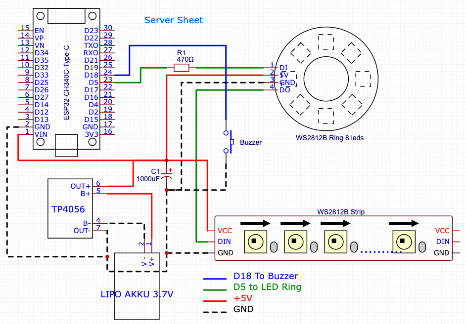
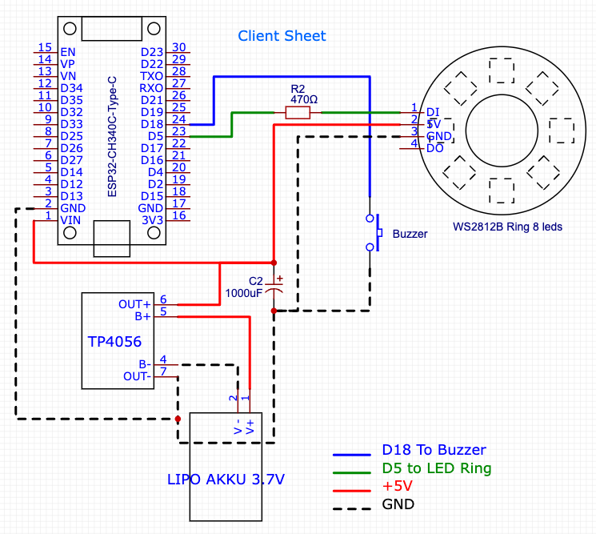

# Wiring Guide - ESP32 Quiz-Buzzer System

Complete step-by-step wiring instructions for building the Server (Quiz Master) and Client (Player Buzzers).

---

## 📋 Tools & Materials Required

### Tools
- Soldering iron (temperature controlled, ~350°C)
- Solder (lead-free recommended)
- Wire strippers
- Multimeter (for testing connections)
- Heat gun or soldering iron tip (for heat inserts)
- Hot glue gun (optional, for strain relief)
- Zip ties or cable ties

### Consumables
- **Wire:** 22-24 AWG silicone wire in multiple colors (recommended: Red=5V, Black=GND, Green=Data, Blue=Button)
- **Heat shrink tubing:** Various sizes
- **Solder**
- **Electrical tape** or **Kapton tape**

---

## 🔌 Pin Configuration (Unified for Server & Client!)

Both Server and Client use **identical pin assignments** - this simplifies assembly!

| Component | GPIO Pin | Notes |
|-----------|----------|-------|
| **LED Data** | **GPIO 5** | WS2812B data line (with 470Ω resistor) |
| **Main Button** | **GPIO 18** | Uses internal pull-up (INPUT_PULLUP) |
| **5V Power** | 5V/VIN | From battery via charging module |
| **Ground** | GND | Common ground for all components |

### LED Count
- **Server:** 18 LEDs total (8 LED ring + 10 LEDs from strip)
- **Client:** 8 LEDs (single LED ring)

---

## 🖼️ Wiring Diagrams

### Server Wiring Diagram

**Key components visible in diagram:**
- ESP32-CH340C-TypeC board
- WS2812B LED Ring (8 LEDs)
- WS2812B LED Strip (10 LEDs for queue display)
- TP4056 Charging Module
- LiPo Battery (3.7V 8000mAh)
- 1000µF Capacitor (power stabilization)
- 470Ω Resistor (R1, LED data line protection)
- Button (with internal pull-up)
- Power Switch

### Client Wiring Diagram

**Key components visible in diagram:**
- ESP32-CH340C-TypeC board
- WS2812B LED Ring (8 LEDs)
- TP4056 Charging Module
- LiPo Battery (3.7V 1800mAh)
- 1000µF Capacitor (C2, power stabilization)
- 470Ω Resistor (R2, LED data line protection)
- Button (with internal pull-up)
- Power Switch

---

## 🔧 Step-by-Step Assembly

### Step 1: Prepare the Enclosure

1. **3D Print the enclosure** (or use custom housing)
2. **Install heat inserts** for M3 screws:
   - Use soldering iron tip or heat insert tool
   - Heat insert to ~250°C and press gently into mounting holes
   - Let cool completely before removing tool
3. **Test fit components** before soldering

### Step 2: Power System Wiring

**IMPORTANT:** Build power system first and test before connecting other components!

#### Battery → Charging Module → ESP32

1. **Solder battery to TP4056 charging module:**
   - Red wire → B+ pad
   - Black wire → B- pad
   - **Add strain relief** with hot glue or zip tie

2. **Add the power switch:**
   - Cut the positive (+) wire between OUT+ and the ESP32
   - Solder switch in line with this wire
   - The switch goes in the hole on the bottom of the enclosure (secure with zip tie)

3. **Connect TP4056 output to ESP32:**
   - OUT+ → ESP32 VIN (or 5V pin)
   - OUT- → ESP32 GND

4. **Test the power system:**
   - Plug USB-C into TP4056 (charging LED should light up)
   - Turn on power switch
   - ESP32 should power up (onboard LED may blink)

### Step 3: LED Wiring

#### Add Protection Components FIRST

1. **Install 1000µF capacitor:**
   - **Negative leg (marked stripe)** → GND rail
   - **Positive leg** → 5V rail
   - **Position:** As close as possible to LED power connection
   - **Purpose:** Smooths power supply, prevents flickering

2. **Install 470Ω resistor in data line:**
   - One leg → GPIO 5 (ESP32)
   - Other leg → DIN (LED data input)
   - **Purpose:** Protects ESP32 GPIO from LED data line spikes

#### Connect the LEDs

**For Client (8 LED Ring):**

1. **LED Ring connections:**
   - 5V → 5V rail (from TP4056 OUT+)
   - GND → GND rail
   - DIN → Through 470Ω resistor → GPIO 5

2. **Wire routing:**
   - Keep LED power wires thick (22 AWG)
   - Keep data wire away from power wires if possible
   - Use color coding (Red=5V, Black=GND, Green=Data)

**For Server (8 LED Ring + 10 LED Strip):**

1. **LED Ring connections:**
   - Same as Client above

2. **LED Strip connections (chained to ring):**
   - LED Ring DOUT → LED Strip DIN
   - LED Strip 5V → 5V rail (parallel connection)
   - LED Strip GND → GND rail (parallel connection)

3. **Important notes:**
   - The strip's first LED is LED #9 in software
   - Data flows: GPIO 5 → Ring (LEDs 1-8) → Strip (LEDs 9-18)
   - Make sure strip is positioned for queue display visibility

### Step 4: Button Wiring

The button uses the ESP32's **internal pull-up resistor** (no external resistor needed!).

1. **Button connections:**
   - One pin → GPIO 18
   - Other pin → GND

2. **Button spring:**
   - Place spring over button stem
   - Ensures tactile feedback

3. **Mounting:**
   - Button goes in top of enclosure
   - Secure with button retainer or hot glue

### Step 5: Final Assembly

1. **Check all connections with multimeter:**
   - Continuity test: GND to all GND points
   - Voltage test: 5V rail should read ~4.1V (battery) or 5V (USB)
   - No shorts: Check 5V to GND (should be open circuit)

2. **Secure all wiring:**
   - Use hot glue for strain relief on battery wires
   - Zip tie wire bundles
   - Ensure no wires can touch and short

3. **Test before closing enclosure:**
   - Power on via switch
   - Upload test firmware
   - Verify all LEDs light up
   - Test button press (check serial monitor)

4. **Close enclosure:**
   - Route power switch through bottom hole
   - Secure with M3 x 8mm screws
   - Don't overtighten (plastic threads!)

---

## 🔍 Wiring Checklist

Use this checklist for each device you build:

### Power System
- [ ] Battery soldered to TP4056 B+/B-
- [ ] Power switch in positive line
- [ ] TP4056 OUT+/OUT- to ESP32 VIN/GND
- [ ] USB charging tested (charging LED on TP4056)
- [ ] Power switch tested (ESP32 turns on/off)

### LED System
- [ ] 1000µF capacitor installed (5V to GND, correct polarity!)
- [ ] 470Ω resistor in data line (GPIO 5 to DIN)
- [ ] LED 5V connected to 5V rail
- [ ] LED GND connected to GND rail
- [ ] LED DIN connected through resistor to GPIO 5
- [ ] (Server only) LED ring DOUT connected to strip DIN

### Button
- [ ] Button connected GPIO 18 to GND
- [ ] Button spring installed
- [ ] Button mechanically secured in enclosure

### Final Tests
- [ ] Multimeter continuity test: All GNDs connected
- [ ] Multimeter voltage test: 5V rail reads ~4.1V (battery)
- [ ] No shorts between 5V and GND
- [ ] Firmware uploads successfully
- [ ] All LEDs light up in test pattern
- [ ] Button registers in serial monitor
- [ ] Device fits in enclosure
- [ ] Power switch accessible through bottom hole

---

## ⚠️ Common Mistakes & Troubleshooting

### LEDs Don't Light Up

**Problem:** No LEDs turn on
- ✅ Check 5V power to LEDs (measure with multimeter)
- ✅ Check GND connection
- ✅ Verify data line connected to GPIO 5
- ✅ Check 470Ω resistor orientation (non-polarized, but should be connected)

**Problem:** LEDs flicker or show wrong colors
- ✅ Check capacitor polarity (stripe = negative!)
- ✅ Measure voltage under load (should be >4V)
- ✅ Check for loose connections
- ✅ Reduce LED brightness in config.h (try 32 instead of 64)

**Problem:** Only first few LEDs work
- ✅ Check data line continuity through entire strip/ring
- ✅ Verify DOUT → DIN connection between ring and strip (server only)
- ✅ One dead LED breaks the chain - check each LED

### Button Doesn't Work

**Problem:** Button presses not detected
- ✅ Check connection GPIO 18 to button
- ✅ Check button to GND connection
- ✅ Verify button is not mechanically stuck
- ✅ Check serial monitor for debug output
- ✅ Ensure firmware has INPUT_PULLUP mode set

**Problem:** Button registers multiple presses (bouncing)
- ✅ Software debouncing should handle this
- ✅ Check DEBOUNCE_MS in config.h (default 20ms)

### Power Issues

**Problem:** Device turns off when LEDs turn on
- ✅ Battery voltage too low (charge battery)
- ✅ Wiring too thin (use 22 AWG minimum)
- ✅ Capacitor not installed or wrong polarity
- ✅ Loose connection in power path

**Problem:** Battery won't charge
- ✅ Check USB-C cable and power source
- ✅ Verify TP4056 charging LED illuminates
- ✅ Check battery connections to B+/B-
- ✅ Replace TP4056 module if damaged

**Problem:** ESP32 reboots randomly
- ✅ Install/check 1000µF capacitor
- ✅ Reduce LED brightness
- ✅ Check for short circuits
- ✅ Verify battery has sufficient capacity

---

## 🧪 Testing Procedure

After assembly, follow this test sequence:

### 1. Power Test (No Code)
1. Connect battery (device OFF)
2. Connect USB-C to TP4056
3. **Expected:** Charging LED on TP4056 lights up
4. Turn power switch ON
5. **Expected:** ESP32 power LED turns on

### 2. Firmware Upload Test
1. Connect ESP32 via USB-C (power switch ON)
2. Upload firmware via PlatformIO
3. **Expected:** Upload succeeds without errors
4. Open serial monitor (115200 baud)
5. **Expected:** Boot messages appear

### 3. LED Test
1. Device should cycle through colors on boot
2. **Expected:** All LEDs light up in sequence
3. **Client:** 8 LEDs should show test pattern
4. **Server:** 18 LEDs should show test pattern

### 4. Button Test
1. Press main button
2. **Expected:** Serial monitor shows button press
3. **Expected:** LED pattern changes (per game state)

### 5. WiFi Test (Client Only)
1. Power on Server first
2. Power on Client
3. **Expected:** Client connects to "QUIZ-HUB"
4. **Expected:** Client shows assigned color

### 6. Game Test (Full System)
1. Server in LOBBY (press button to start)
2. Client pulsing in player color
3. Press client button to buzz
4. **Expected:** Server shows buzz order
5. **Expected:** Client turns white (locked)

---

## 📐 Wire Length Recommendations

| Connection | Recommended Length | Notes |
|------------|-------------------|-------|
| Battery → TP4056 | 10-15 cm | Original battery wires, keep short |
| TP4056 → ESP32 | 8-10 cm | Power delivery, keep thick |
| ESP32 → LEDs | 10-15 cm | Data + Power, allow for routing |
| Button → ESP32 | 8-10 cm | Short runs = less noise |
| LED Ring → Strip | 5-8 cm | (Server only) Data line |

**General tips:**
- Pre-cut and strip all wires before starting
- Label wires with tape if working with many
- Use different colors for easy troubleshooting
- Leave 1-2cm extra length for strain relief

---

## 🎨 Wire Color Convention (Recommended)

Using consistent colors makes troubleshooting much easier:

| Color | Use |
|-------|-----|
| **Red** | +5V / VIN / Positive |
| **Black** | GND / Ground / Negative |
| **Green** | LED Data (DIN/DOUT) |
| **Blue** | Button signal |
| **Yellow** | Optional: Additional signals |
| **White** | Optional: Additional signals |

---

## 🛠️ Advanced: Modifications

### Adding Additional Buttons (Server)

The server design includes provisions for additional control buttons:

- **GPIO 19:** "Next player" button (wrong answer)
- **GPIO 21:** "Correct answer" button

These are optional and can be added if you prefer dedicated buttons instead of short/long press patterns.

### Level Shifter (Optional)

While not strictly required, adding a 3.3V → 5V level shifter between GPIO 5 and LED DIN improves reliability:

1. Connect ESP32 GPIO 5 → Level shifter input
2. Connect Level shifter output → 470Ω resistor → LED DIN
3. Connect Level shifter 5V and GND appropriately

**When to add:**
- Long wire runs (>30cm)
- Experiencing intermittent LED issues
- Using in electrically noisy environment

---

## 📸 Assembly Tips & Tricks

1. **Tin all wire ends before connecting** - makes soldering much easier
2. **Use heat shrink on all solder joints** - prevents shorts
3. **Test continuity after each connection** - catch errors early
4. **Take photos during assembly** - helps for repairs later
5. **Build one Client first** - test the system before building all 10
6. **Label completed devices** - mark each with its player number/color

---

## 🔋 Battery Safety

**Important safety notes:**

⚠️ **LiPo batteries can be dangerous if mishandled!**

- Never short circuit battery terminals
- Never puncture or damage battery
- Don't over-discharge (below 3.0V)
- Don't overcharge (above 4.2V per cell)
- Store at 40-60% charge for long term
- Use fire-safe charging bag when possible
- Dispose of damaged batteries properly

The TP4056 module handles charging safely, but always supervise charging!

---

## ✅ Pre-Flight Checklist (Before Event)

Before taking the system to a wedding/event:

- [ ] All devices fully charged
- [ ] Spare USB charging cables packed
- [ ] Test all devices power on successfully
- [ ] Verify all LEDs work on all devices
- [ ] Test button response on all devices
- [ ] Server creates "QUIZ-HUB" WiFi successfully
- [ ] All clients connect and get assigned colors
- [ ] Test buzz functionality with 2-3 clients
- [ ] Enclosures securely closed with all screws
- [ ] Power switches easily accessible
- [ ] Device labels visible (optional but helpful)

---

**Congratulations!** 🎉 

If you followed this guide, you now have a fully functional quiz buzzer system. Time to test it at your next event!

For operating the system, see the [User Manual](USER_MANUAL.md).

For technical details and troubleshooting, see the [Technical Specification](TECHNICAL_SPECIFICATION.md).

---

**Safety first, solder well, and happy building! 🔧✨**
